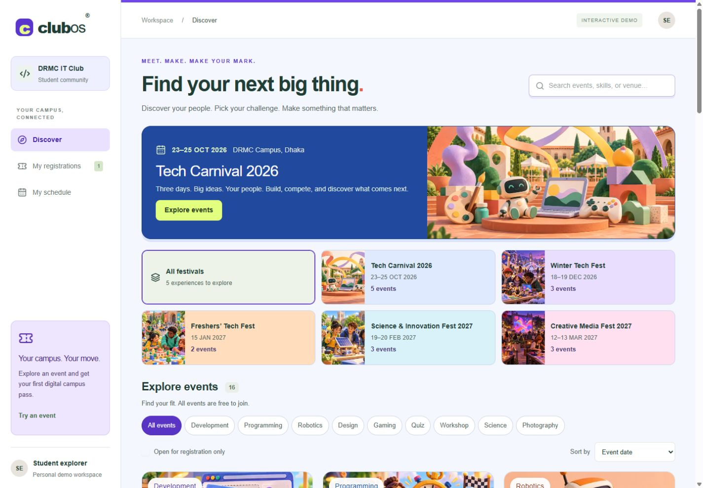
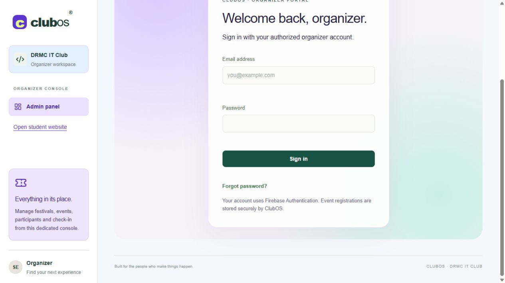
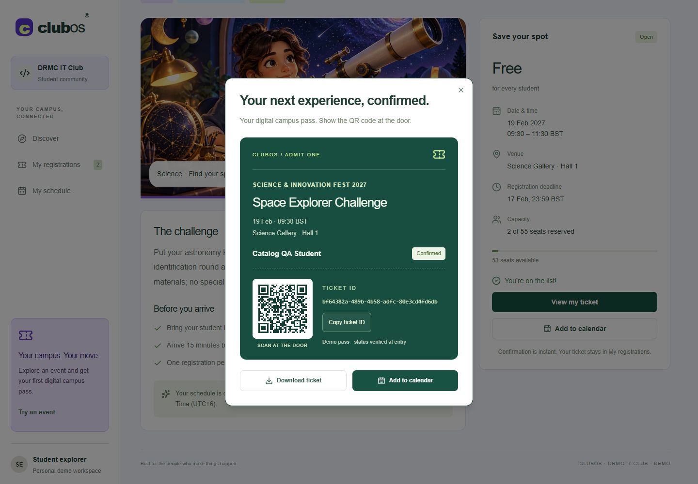
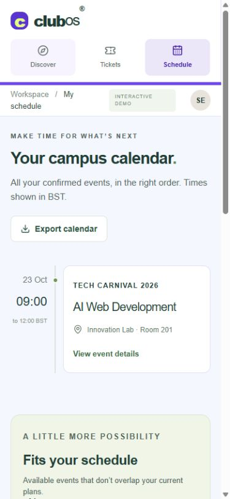

# ClubOS

**Make your next move.** A student-club operations platform built for the Smart Club Operations theme at the 9th DRMC International Tech Carnival 2026 AI Web Development Contest.

**Looking for the three test accounts? [Email and password table](#demo-credentials).**

## Project description

ClubOS follows **Organization → Festival → Event → Registration**. Students discover festivals, explore events, register individually or with accepted teammates, and manage a personal schedule. Organizers create and edit festivals and events, manage participants, and check in ticket holders.

This submission is a shared, database-backed club application with **Firebase Authentication** and server-enforced organizer permissions. It is not the official DRMC registration system. Festival/event content and the 24 seeded participants are fictional demonstration data. Real student accounts can register after email verification. Complete [Firebase setup](docs/FIREBASE-SETUP.md) before evaluating authenticated flows.

## Features

- Sixteen distinct event-specific covers and five different festival banners. No artwork is shared by different sample events. Responsive WebP sizes and lazy loading keep the colorful directory lightweight.

- Five preloaded festivals, sixteen categorized events, and twenty-four sample registrations.
- Search event titles, descriptions, categories, and venues; festival/category filters, open-seat filtering, and date/deadline sorting.
- Event detail URLs, dates, venues, registration deadlines, capacity, and availability.
- Validated registration forms; free entries confirm immediately, paid entries require organizer Trx ID verification.
- Solo/Team selector at the top of every registration form, with inline teammate search, invitation sending and accepted-member status.
- Phone number at signup, opt-in teammate directory, collaboration invitations, group leaders/names, and shared team registration history.
- Admin-managed BDT fees/payment numbers, preserved payment snapshots and pending-payment slot reservations.
- **Announcement system:** organizers publish campus updates from the admin panel; Firebase Realtime Database delivers them to the website's header notification bell, with important notices, optional expiry dates and links to relevant event/blog pages.
- **Notification system:** an unread badge, saved announcement read state, Mark all as read, and actionable team invitations help students keep track of updates. Supported devices can opt in to Web Push; exported calendars include reminder alarms. Automatic 24-hour/1-hour push reminders still await scheduler connection; see [setup and limits](docs/TEAMS-PAYMENTS-NOTIFICATIONS.md).
- Server-enforced deadlines, capacity and normalized-email duplicate prevention.
- Atomic final-seat booking: concurrent requests cannot overbook an event.
- My registrations, cancellation, ticket downloads, and persistent state after refresh.
- Dedicated `/admin` organizer URL, separate from student navigation, with participant search, event/status filters, and status management.
- Shared catalog across accounts, private student registration lists, and a server-side organizer UID allowlist.
- Event management: thumbnails, titles, festivals, categories, times, venue, capacity, eligibility, requirements, rules, format and registration pause controls.
- Student profiles and full registration history; organizer student directory and registration detail dialogs.
- Ten editable sample blog posts, draft/publish controls, announcement bell, and editable helpline contacts.
- Firestore owner/admin profile permissions and admin-only publishing rules. Placeholder phone numbers never initiate a call.
- Registration chart, capacity watch, and check-in totals based on stored records.
- Responsive layouts, accessible dialog/select/tab primitives, keyboard focus, and reduced-motion support.

### Performance

Firebase Authentication loads after the initial page render. Admin tools and the QR encoder load on demand. Counts are aggregated on the server without exposing attendee details, and date/time formatters are reused. Images have responsive WebP variants. See [verification details](docs/DELIVERY.md).

The [rulebook coverage map](docs/RULEBOOK-COVERAGE.md) links each judging section to the implemented workflow and separates completed work from pending submission steps.

### Creative extras

- **Personal schedule and conflict detection:** overlapping registrations require explicit acknowledgement; conflicts remain visible in the schedule.
- **Fits your schedule:** deterministic suggestions exclude full, closed, registered, and overlapping events.
- **Portable calendar:** export one event or a complete schedule as an ICS file.
- **QR campus pass:** a styled, printable SVG download with a scannable unique ticket ID, with text fitted to the layout.
- **At-the-door check-in:** paste a scanned QR payload or full ticket ID to mark attendance; server checks reject cancelled and already-used passes.
- **Useful data export:** filtered participant CSV with spreadsheet-formula injection protection.
- **Account-based access:** registrations follow a Firebase account across devices; only approved organizers can manage all participants.
- Progressive-enhancement WebMCP search tool when the browser supports it.
-  Helpline contact for fast support.
- **Live campus announcement center:** organizers can publish schedule changes, event instructions and other updates without editing the website code. The header bell opens a single Campus updates panel, with unread counts, Important labels, Bangladesh-time timestamps and Open details links. Realtime Database subscriptions bring announcement changes into the app; expired notices are hidden when the panel renders. Signed-in students can mark announcements as read, with their read state saved privately to their account.
- **Actionable collaboration notifications:** team invitations appear alongside campus updates and contribute to the notification badge. Students can accept or decline an invitation directly; only accepted teammates are included when the leader registers the group. This turns an update into a clear next action while preserving participant consent.
- **Optional device alerts and portable reminders:** on supported browsers/devices, students can enable encrypted Web Push for invitation alerts, including when the website is not in the foreground, subject to browser/OS delivery policies. Calendar exports contain one-day and one-hour alarms for the user's calendar app. Automatic contest push reminders have a tested background writer, but scheduling is **not enabled yet**; announcement publication itself does not broadcast a device push. These live notification features are separate from the isolated browser-local judge demo. See [notification setup and current limits](docs/TEAMS-PAYMENTS-NOTIFICATIONS.md).
-  Blogs for past event stroys and new ideas

## Tech stack

React 19, TypeScript, Vinext / Vite, Cloudflare Workers, Cloudflare D1 (SQLite), Firebase Authentication, Firestore, Realtime Database, jose JWT verification, Drizzle schema migrations, Tailwind CSS, Shadcn/Radix UI, Lucide icons, Sonner notifications, node-qrcode.

## Setup instructions

In app setup 
- Open the website
- Select a event
- Create account
- Register team or solo by fill up details
- Use /admin in the URL to go to the admin and checkout details

Event  creation
-Select event mangement in admin page just under the active registation
-Enter detail 
-Save details

App Bulid setup 
Requirements: Node.js 24 (for the SQLite test harness), npm, Git, and the configured Firebase project. Follow [the console guide](docs/FIREBASE-SETUP.md) to enable Email/Password, authorize the domain, verify an account and authorize the organizer UID. D1 is authoritative for festivals, events, registrations and seat counts. Firestore stores student profiles, blogs and helpline contacts; Realtime Database stores announcements and notification read state.

```sh
npm ci
npm run build
node --import ./scripts/sites-env.mjs ./node_modules/wrangler/bin/wrangler.js d1 execute DB --local --config dist/server/wrangler.json --persist-to .wrangler/state --file drizzle/0000_normal_chamber.sql
node --import ./scripts/sites-env.mjs ./node_modules/wrangler/bin/wrangler.js d1 execute DB --local --config dist/server/wrangler.json --persist-to .wrangler/state --file drizzle/0001_exotic_firestar.sql
node --import ./scripts/sites-env.mjs ./node_modules/wrangler/bin/wrangler.js d1 execute DB --local --config dist/server/wrangler.json --persist-to .wrangler/state --file drizzle/0002_small_typhoid_mary.sql
npm run dev
```

Open the exact local address printed by the server (normally `http://127.0.0.1:5173`). Apply each migration only once to a given local database. The shared catalog and sample registrations are inserted idempotently on the first visit, outside migrations. Old browser-isolated demo records are retained in the database but are not reassigned to accounts or served by the new API. Nothing is seeded into production at build time.

To preview the compiled Worker, use `npm start` after building and applying migrations. This shares the local D1 state with development.

### Verification

```sh
node node_modules/typescript/bin/tsc --noEmit
node scripts/test-firebase.mjs
node scripts/test-account-request.mjs
node scripts/test-community.mjs
node scripts/test-push.mjs
npm run build
```

The current test harness exercises the real API and JWT verifier with signed RSA fixtures, an in-memory SQLite database, and simulated Google public-key/account responses. It covers authentication, disabled/revoked accounts, organizer permissions, private registration reads, ownership, forged email rejection, deadlines, capacity, duplicate registration, conflicts, check-in and simultaneous final-seat requests. It creates no users in the real Firebase project. Real email delivery and end-to-end production sign-in remain dependent on the owner's Console setup.

## Source repository

https://github.com/myfavnigar-ux/clubos

## Deployment URL

**Live demo:** [Open ClubOS](https://clubos-carnival-somudro.anaim12.chatgpt.site). The directory is public. Registration requires a verified account; `/admin` requires an approved organizer account. See [the judge walkthrough](docs/JUDGE-GUIDE.md) for a guided tour.

Sites manages the Worker, persistent D1 binding, schema migrations, and source-backed deployments. `.openai/hosting.json` declares the logical `DB` binding. Do not commit real Cloudflare account credentials, API tokens, or private runtime state.

## Demo credentials

Open **https://clubos-carnival-somudro.anaim12.chatgpt.site/judge-demo**.

| Role | Public demo login | Public demo password |
| --- | --- | --- |
| Student | `student@clubos.demo` | `ClubOS-Judge-2026` |
| Teammate | `partner@clubos.demo` | `ClubOS-Judge-2026` |
| Organizer | `organizer@clubos.demo` | `ClubOS-Judge-2026` |

These intentionally public credentials unlock only an isolated browser-local sample workspace. They are not Firebase credentials and cannot authorize `/admin` or `/api/club`. No verification or 2FA is required for this demo. Registration, accepted team invitations, payment review, event/festival editing, check-in and CSV export are interactive; localStorage retains sample changes across reloads and account switches in the same browser. Reset demo restores fictional seed data. Dates shift forward when starting a fresh demo so judges can evaluate booking after the contest deadline. Design Beyond Screens starts full and Campus Gaming Cup starts closed.

The demo uses a separate local data adapter, not the production backend. It does not validate production networking, live Firebase profiles/community writes or actual device push. Production remains Firebase-authenticated and database-backed; real users and records are not exposed by these credentials. Demo paid events say `DEMO-NO-PAYMENT`; do not transfer money or enter personal data. Cloud-only admin tabs are intentionally absent from the demo. The main website supports those features for authorized real accounts.

See [the 5-minute judge walkthrough](docs/PUBLIC-JUDGE-DEMO.md) and [the copy-ready submission entry](docs/SUBMISSION.md). Final marks belong to the judges; rubric coverage is not a guaranteed score.

## Third-party services and APIs

- OpenAI Sites: application hosting and deployment workflow.
- Cloudflare Workers and D1: server runtime and durable database.
- Firebase Authentication: sign-in, signup, verification and password reset emails; Google public keys and account lookup for API authentication. No ticket email, payment gateway, analytics or generative-AI API is used at runtime. Trx IDs are manually verified by organizers.
- System fonts, Lucide interface icons, and locally hosted responsive WebP illustrations avoid external asset requests.
- Browser Web Push services: encrypted device notifications using a server-secret VAPID key; Sites MCP provides the bounded background reminder writer. Automatic scheduling still requires a connected task.
- Dependencies and their license metadata are listed in `THIRD-PARTY-NOTICES.md` and the lockfile.

## AI tools and features used

OpenAI Codex assisted with rulebook analysis, product planning, source generation, styling, test implementation, and debugging. AI-generated code and sample content are disclosed here. Twenty-one original clay-style illustrations were created with OpenAI’s built-in image generation tool for five festivals, sixteen events, and schedule views. They are illustrative artwork, not photographs of real campus events. The complete prompt set and asset locations are recorded in [AI art prompts](docs/AI-ART-PROMPTS.md). The app does not call an AI model; its search, statistics, and schedule conflict detection are deterministic. WebMCP exposes directory search to supported browser agents and is not an embedded AI assistant.

## Screenshots

### Festival and event directory



### Protected organizer sign-in



The following ticket/schedule screenshots illustrate the previous evaluation data; the layouts remain available after signing in and registering.

### Digital ticket



### Mobile schedule



## Known limitations

- Email/Password and the production domain are configured. The owner supplied the admin UID, which is set in the server environment. Database rule publication and real account walkthrough status are tracked in docs/LAUNCH-STATUS.md.
- Event and registration data stays in D1. Profiles, blogs and support use Firestore; announcements use Realtime Database. No Firebase Storage, Functions or Analytics is initialized. Images are edited using HTTPS URLs or bundled illustration paths.
- No ticket-confirmation email, automatic payment gateway, or integrated QR camera scanning. Paid registrations use organizer Trx ID review; teams register with accepted members. Verification and reset emails are handled by Firebase. Use an external QR reader for check-in.
- Events and passes demonstrate a club platform; they are not official admission to DRMC events. Seed event dates run October 2026–March 2027; organizers can update them.
- Shared organizer edits affect all visitors. The old isolated demo workspaces remain inaccessible to new accounts; no personal history is guessed or transferred.
- The event catalog and counts refresh on window focus and every 15 seconds while visible. Community content uses Firebase subscriptions after database setup.
- Larger public rollouts should add workload-specific abuse limits, monitoring, backups and data-retention policies. The application currently relies on Firebase's authentication limits and server booking checks.
- The public source is published in this repository. Official contest form submission remains pending; see [submission entry](docs/SUBMISSION.md). A contest score cannot be guaranteed.

## License

MIT. See [LICENSE](LICENSE). Third-party components retain their respective licenses and notices.

The organizing authority reserves the right to make the final decision regarding rule
interpretation, eligibility, judging, scoring, and any matters not explicitly covered in
these guidelines. All decisions made by the judging panel and organizing authority
shall be final.


## Latest contest polish

Festival tiles open reloadable, shareable festival pages with dates, venues, artwork, open-event counts and event lists. Event pages link back to the festival. Admin Overview includes a pending-payment review queue and verified fee totals based on saved booking amounts. Participant search covers teams, members and Trx IDs; CSV includes team/payment details. Existing account verification links remain; custom email OTP and ticket emails are out of scope at the owner's request. See [judge guide](docs/JUDGE-GUIDE.md) for the walkthrough and remaining submission requirements.
